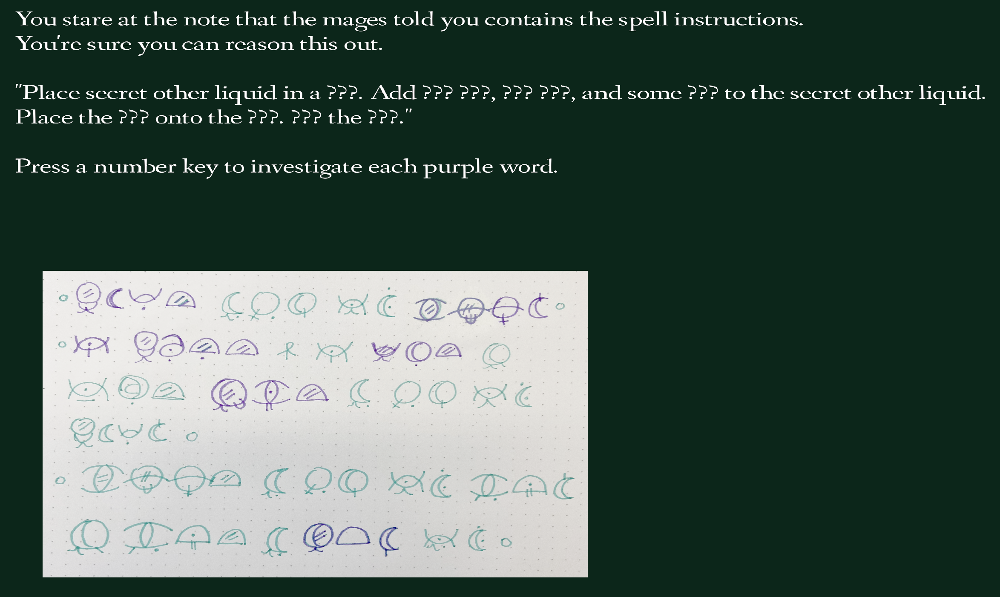

# Material Components

Author: Sasha Mishkin

Design: This is really just a proof of concept and a full story cannot be played out yet. The player is left alone in a room and tasked to prepare components for a spell while the mages tend to urgent business. The goal of the game is to contextually figure out (or just guess) which words go into a sentence in an unfamiliar language / writing system, but currently you can only do this with one word.

Text Drawing: I store the font file in `dist` and render it at runtime. I use Harfbuzz to read a string and turn it into a list of codepoints and positions. Then I use Freetype to obtain the corresponding glyph from the codepoint, and arrange the bitmap into an image texture. I position and resize the texture with the help of some glyph metrics that Freetype gives me, and positions from Harfbuzz. As for the writing system in my conlang, it appears as an image drawn on paper, for now. It would be cool to figure out how to get the symbols to render as text, though.

Choices: Rooms are stored as structs that contain their descriptions and images, and associated words to be translated, as well as rooms that they lead back to. The choices that the player makes only consist of how the player chooses to translate each unknown word, so I just store an index into a list of possible options for translations of that word.

Screen Shot:

How To Play:

Press number keys as indicated onscreen. Currently, on the screen with the image of written stuff, only pressing "1" will work.

Sources: Font - [Fanwood text](https://fonts.google.com/specimen/Fanwood+Text?script=Latn), from Google Fonts

This game was built with [NEST](NEST.md).
